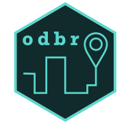

<!-- README.md is generated from README.Rmd. Please edit that file -->

# odbr: Download Data from Brazil’s Origin Destination Surveys 

<!-- badges: start -->

[](https://app.codecov.io/gh/hsvab/odbr?branch=main)
[](https://github.com/hsvab/odbr/actions?query=branch%3Amain)
[](https://ropensci.org/champions/)

<!-- badges: end -->

**odbr** is an R package to download data from Brazil’s Origin
Destination Surveys. The package provides databases, maps, and data
dictionaries in English, Portuguese, and Spanish. Furthermore, it is
possible to download harmonized data across different cohorts for the
same city.

## Installation

You can install the development version of odbr from
[CRAN](https://CRAN.R-project.org/package=odbr) with:

``` r
# install from CRAN
install.packages("odbr")
library(odbr)
```

You can install the development version of odbr from
[GitHub](https://github.com/) with:

``` r
# or use the development version with latest features
devtools::install_github("hsvab/odbr")
library(odbr)
```

## Basic Usage

The syntax of all `odbr` functions operate on the same logic so it
becomes intuitive to download any data set using a single line of code.
Like this:

``` r
library(odbr)

# Return data from OD Surveys database as data.frame
df <- read_od(
  city = "Sao Paulo",
  year = 2017,
  harmonize = FALSE
)

# Return zone data from OD Surveys database as sf object at a given city and year
df <- read_map(
  city = "Sao Paulo",
  year = 2017,
  harmonize = FALSE,
  geometry = "zone"
)

# Return data dictionary from OD Surveys, as data.frame, at a given city and year
df <- read_dictionary(
  city = "Sao Paulo",
  year = 2017,
  harmonize = FALSE,
  language = "pt"
)
```

## Available non-harmonized datasets:

**The original geodetic reference system remained unchanged.**

| City      | Years available              | Harmonized | Dictionary languages | Source                                                                             |
|-----------|------------------------------|------------|----------------------|------------------------------------------------------------------------------------|
| São Paulo | 1977, 1987, 1997, 2007, 2017 | No         | en, es, pt-br        | [Metrô-SP](https://transparencia.metrosp.com.br/dataset/pesquisa-origem-e-destino) |

## Available harmonized datasets:

**All harmonized datasets use geodetic reference system “SIRGAS2000”,
CRS(4674).**

There is not harmonized data available yet.

## Contributing to odbr

If you would like to contribute to **odbr**, you’re welcome to open an
issue to explain the proposed a contribution.

## Credits

Original databases and shapefiles are created by local official
government institutions.

The logo was designed by [Marcos Kyoto de Tani e
Isoda](https://www.instagram.com/redes.urbanas/)

If you want to cite this package, you can cite it as:

- Svab, Haydee; Milz, Beatriz; Oliveira, Diego Rabatone; Pereira,
  Rafael H. M. (2023) odbr: Download Data from Brazil’s Origin
  Destination Surveys. R package version v0.1.0,
  <https://CRAN.R-project.org/package=odbr>.

<!-- -->

    bibentry(
      bibtype  = "Manual",
      title       = "odbr: Download Data from Brazil's Origin Destination Surveys",
      author      = "Haydee Svab [aut, cre] and Beatriz Milz [aut] and Diego Rabatone Oliveira [aut] and Rafael H. M. Pereira [aut]",
      year        = 2023,
      version     = "v0.1.0",
      url         = "https://CRAN.R-project.org/package=odbr",
      textVersion = "Svab, H.; Milz, B.;  Oliveira, D. R.; Pereira, R. H. M. (2023) odbr: Download Data from Brazil's Origin Destination Surveys v0.1.0, <https://CRAN.R-project.org/package=odbr>."
    )

## Sponsors <a href="https://ropensci.org/"></a>

The **odbr** package was initially sponsored by rOpenSci through its
Champions Program (2022 edition) whose main goal is to provide support
to R developers from around the world who identify themselves as members
of groups that are systematically excluded from the open-source software
community.
